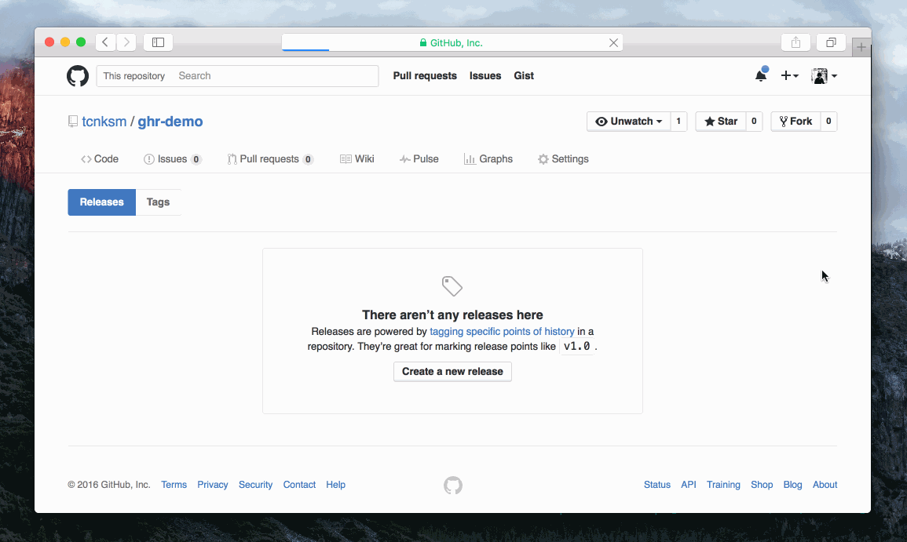

ghr
====

[][release]
[][GitHub Actions]
[][PkgGoDev]
[][license]

[release]: https://github.com/tcnksm/ghr/releases
[GitHub Actions]: https://github.com/tcnksm/ghr/actions/workflows/test.yml
[license]: https://github.com/tcnksm/ghr/blob/master/LICENSE
[PkgGoDev]: https://pkg.go.dev/github.com/tcnksm/ghr

`ghr` creates GitHub Release and uploads artifacts in parallel.

## Demo

This demo creates GitHub Release page with `v1.0.0` tag and uploads cross-compiled golang binaries.



You can see release page [here](https://github.com/tcnksm/ghr-demo/releases/tag/v1.0.0).

## Usage

Using `ghr` is simple. After setting GitHub API token (see more on [GitHub API Token](#github-api-token) section), change into your repository root directory and run the following command:

```bash
$ ghr [option] TAG [PATH]
```

You must provide `TAG` (git tag) and optionally a `PATH` to artifacts you want to upload. You can specify a file or a directory. If you provide a directory, all files in that directory will be uploaded.

`ghr` assumes that you are in a git repository when executed. This is because normally the artifacts you want to upload to a GitHub Release page are in that repository or generated there. With this assumption, `ghr` *implicitly* reads repository URL from `.git/config` file. But you can change this kind of information, see [Options](#options) section.

### GitHub API Token

To use `ghr`, you need to get a GitHub token with an account which has enough permissions to create releases. To get a token, visit GitHub account settings page, then go to Applications for the user. Here you can create a token in the Personal access tokens section. For a private repository you need `repo` scope and for a public repository you need `public_repo` scope.

When using `ghr`, you can set it via `GITHUB_TOKEN` env var, `-token` command line option or `github.token` property in `.gitconfig` file.

For instance, to set it via environment variable:

```bash
$ export GITHUB_TOKEN="....."
```

Or set it in `github.token` in gitconfig:

```bash
$ git config --global github.token "....."
```

Note that environment variable take precedence over gitconfig value.

### GitHub Enterprise

You can use `ghr` for GitHub Enterprise. Change API endpoint via the environment variable.

```bash
$ export GITHUB_API=http://github.company.com/api/v3/
```

## Example

To upload all files in `pkg/` directory with tag `v0.1.0`

```bash
$ ghr v0.1.0 pkg/
--> Uploading: pkg/0.1.0_SHASUMS
--> Uploading: pkg/ghr_0.1.0_darwin_386.zip
--> Uploading: pkg/ghr_0.1.0_darwin_amd64.zip
--> Uploading: pkg/ghr_0.1.0_linux_386.zip
--> Uploading: pkg/ghr_0.1.0_linux_amd64.zip
--> Uploading: pkg/ghr_0.1.0_windows_386.zip
--> Uploading: pkg/ghr_0.1.0_windows_amd64.zip
```

## Options

You can set some options:

```bash
$ ghr \
    -t TOKEN \        # Set Github API Token
    -u USERNAME \     # Set Github username
    -r REPO \         # Set repository name
    -c COMMIT \       # Set target commitish, branch or commit SHA
    -n TITLE \        # Set release title
    -b BODY \         # Set text describing the contents of the release
    -p NUM \          # Set amount of parallelism (Default is number of CPU)
    -delete \         # Delete release and its git tag in advance if it exists (same as -recreate)
    -replace \        # Replace artifacts if it is already uploaded
    -draft \          # Release as draft (Unpublish)
    -soft \           # Stop uploading if the same tag already exists
    -prerelease \     # Create prerelease
    -generatenotes \  # Generate Release Notes automatically (See below)
    TAG PATH
```

## Install

If you are a macOS user, you can use [Homebrew](https://brew.sh/):

```bash
$ brew install ghr
```

If you are on another platform, you can download a binary from our [release page](https://github.com/tcnksm/ghr/releases) and place it in `$PATH` directory.

Or you can use `go install`.

```bash
$ go install github.com/tcnksm/ghr@latest
```

## VS.

- [aktau/github-release](https://github.com/aktau/github-release) - `github-release` can also create and edit releases and upload artifacts. It has many options. `ghr` is a simple alternative. And `ghr` will parallelize upload artifacts.

## Generate Release Notes

GitHub added the ability to automatically generate the body of a Release based on a format specified in
`.github/release.yml` in Oct 2021. You can read more about that format [here](https://docs.github.com/en/repositories/releasing-projects-on-github/automatically-generated-release-notes#configuring-automatically-generated-release-notes).
ghr now has the `-generatenotes` flag to enable that content to be programmatically added instead of manually supplying the body.

## Contribution

1. Fork ([https://github.com/tcnksm/ghr/fork](https://github.com/tcnksm/ghr/fork))
2. Create a feature branch
3. Commit your changes
4. Rebase your local changes against the master branch
5. Run test suite with the `make test` command and confirm that it passes using correct variables e.g. `GITHUB_TOKEN=$GITHUB_TOKEN TEST_REPO_OWNER=tcnksm TEST_REPO_NAME=ghr make test`
6. Run `gofmt -s -w .`
7. Create new Pull Request

## Author

[Taichi Nakashima](https://github.com/tcnksm)
